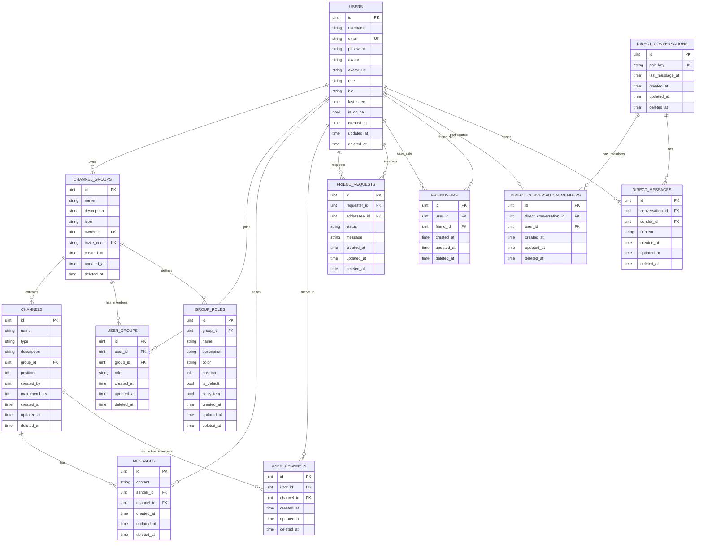

# Chatting 实时聊天系统

Chatting 是一个面向频道聊天、私信、好友、语音频道和后台管理的实时聊天应用。当前版本使用 Go 后端、Next.js 前端、PostgreSQL、Redis、Kafka/Redpanda 和 LiveKit，支持 Docker Compose 一键部署。

## 当前能力

- 用户注册、登录、资料编辑、头像上传、在线状态和心跳
- Group/频道体系：创建 group、加入 group、文本频道、语音频道、频道成员
- 实时消息：频道消息和私信通过 WebSocket 推送，跨后端实例事件通过 Kafka/Redpanda fanout
- 私信和好友：好友搜索、好友申请、好友列表、非好友私信提示
- Group 权限：所有者、默认管理员、嘉宾、自定义身份组、成员身份设置
- 语音频道：LiveKit 语音加入、离开、频道人数限制、实时参与者展示
- 管理后台：用户、group、频道消息、私信消息和统计信息管理
- 文件上传：图片上传和消息图片展示
- 演示数据：内置 `seed-demo`，可生成百人 group、百条以上聊天记录、图片消息和私信会话

## 技术栈

### 后端

- Go 1.23
- Gin
- GORM
- PostgreSQL 16
- Redis 7
- Kafka 兼容事件总线：Redpanda
- WebSocket：`gorilla/websocket`
- LiveKit
- JWT

### 前端

- Next.js 16
- React 19
- TypeScript
- Tailwind CSS 4
- Zustand
- lucide-react
- livekit-client

## 快速启动

### Docker Compose

推荐从项目根目录启动：

```bash
docker compose up -d
```

访问地址：

- HTTP: `http://localhost:8080`
- HTTPS: `https://localhost:8443`
- 后端健康检查: `http://localhost:3001/health`

Docker 默认 HTTPS 是自签证书，只适合本地测试。服务器部署请给 nginx 配置真实域名证书，并把 `.env` 中 `NGINX_SSL_MODE` 改成 `provided`，否则浏览器会拦截 HTTPS 请求并报 `ERR_CERT_AUTHORITY_INVALID`。

如果需要重新构建某个服务，优先只构建受影响容器：

```bash
docker compose build backend
docker compose up -d backend

docker compose build frontend
docker compose up -d frontend nginx
```

### Windows 本地启动

项目根目录提供 `start.bat`：

```bat
start.bat
```

可选择：

- 前端 + Go 后端
- 仅 Go 后端
- 仅前端
- Docker Compose

### Linux 服务器部署

```bash
chmod +x deploy.sh deploy-quick.sh
./deploy.sh
```

快速部署：

```bash
./deploy-quick.sh
```

部署细节见 [DOCKER_DEPLOY.md](./DOCKER_DEPLOY.md)。

## 演示数据

后端镜像会同时构建 `seed-demo` 命令。它会生成一个便于演示的固定场景：

- 账号名：`foya`
- 邮箱：`foya@example.com`
- 密码：`123456`
- Group：`test`
- 100 个 group 成员
- `general` 文本频道 128 条消息，其中包含图片消息
- `voice-demo` 语音频道
- `foya` 与 5 个演示用户的私信会话
- 其他用户邮箱：`demo001@test.com` 到 `demo099@test.com`
- 其他用户密码：`123456`

执行：

```bash
docker compose exec backend ./seed-demo
```

本地非 Docker 后端也可以执行：

```bash
cd backend-go
go run ./cmd/seed-demo
```

该命令可重复运行，会更新演示账号、演示 group、成员、频道，并重建 `test/general` 的演示消息和 `foya` 的演示私信。

## 项目结构

```text
chatting/
├── backend-go/
│   ├── cmd/
│   │   ├── server/          # 后端服务入口
│   │   └── seed-demo/       # 演示数据生成命令
│   ├── internal/
│   │   ├── config/          # 配置加载
│   │   ├── controller/      # HTTP 控制器
│   │   ├── events/          # Kafka/Redpanda 事件总线
│   │   ├── livekit/         # LiveKit token 等能力
│   │   ├── middleware/      # CORS、JWT、管理员鉴权
│   │   ├── model/           # GORM 模型和响应结构
│   │   ├── redis/           # Redis 客户端
│   │   ├── repository/      # 数据访问层
│   │   ├── router/          # Gin 路由
│   │   ├── service/         # 业务逻辑
│   │   └── socket/          # WebSocket hub 和连接处理
│   └── Dockerfile
├── frontend/
│   ├── src/
│   │   ├── app/             # Next.js App Router 页面
│   │   ├── components/      # UI 组件
│   │   ├── hooks/           # React hooks
│   │   ├── lib/             # API、WebSocket、工具函数
│   │   └── store/           # Zustand 状态
│   └── Dockerfile
├── docker/
│   ├── nginx/               # Nginx 反向代理和 SSL
│   ├── postgres/            # 数据库初始化 SQL
│   └── livekit.yaml         # LiveKit 配置
├── docker-compose.yml
├── deploy.sh
├── deploy-quick.sh
└── start.bat
```

## 数据库 ER 图

主要业务表由 Go 后端的 GORM 模型自动迁移生成。所有带 `gorm.Model` 的表都会包含 `id`、`created_at`、`updated_at`、`deleted_at`，其中 `deleted_at` 用于软删除。



## 服务端口

| 服务 | 默认端口 | 说明 |
| --- | --- | --- |
| nginx | 8080 / 8443 | 前端、API、WebSocket、LiveKit 反向代理 |
| frontend | 3000 | Next.js 容器内部服务 |
| backend | 3001 | Go API 和 WebSocket |
| postgres | 5432 | PostgreSQL |
| redis | 6379 | 在线状态、语音频道活跃成员等 |
| kafka | 19092 / 9644 | Redpanda Kafka 外部端口和管理端口 |
| livekit | 7880 / 50000-50200 UDP | 语音信令和 WebRTC 媒体端口 |

## 常用命令

```bash
# 查看服务状态
docker compose ps

# 查看日志
docker compose logs -f backend
docker compose logs -f frontend
docker compose logs -f nginx

# 后端测试
cd backend-go
go test ./...

# 前端检查和构建
cd frontend
npm run lint
npm run build

# 进入数据库
docker compose exec postgres psql -U postgres -d chat_app

# 执行演示 seed
docker compose exec backend ./seed-demo
```

## 主要环境变量

根目录 `.env.example` 用于 Docker Compose；`backend-go/.env.example` 用于本地 Go 后端；`frontend/.env.local.example` 用于本地 Next.js 前端。

关键项：

- `DB_USERNAME` / `DB_PASSWORD` / `DB_NAME`
- `REDIS_PASSWORD`
- `JWT_SECRET`
- `ADMIN_EMAIL` / `ADMIN_USERNAME` / `ADMIN_PASSWORD`
- `KAFKA_BROKERS`
- `NEXT_PUBLIC_API_URL`
- `NGINX_HTTP_PORT` / `NGINX_HTTPS_PORT`

生产环境必须替换默认密码和 `JWT_SECRET`。

## API 文档

OpenAPI 文件位于 [api-docs.json](./api-docs.json)。

## API 性能报告

这份报告来自一次针对线上地址的基准测试，记录于 `2026-05-31T17:49:14.736Z`。测试目标是观察当前 API 在较高并发下的响应稳定性，并为后续优化提供基线。

- Base URL: `https://124.221.164.235:8443`
- Requests per endpoint: `400`
- Concurrency: `5`

| endpoint | requests | success | failed | rps | p50 | p75 | p95 | p99 | avg | max |
| --- | ---: | ---: | ---: | ---: | ---: | ---: | ---: | ---: | ---: | ---: |
| health | 400 | 400 | 0 | 133.1 | 36.5ms | 37ms | 38.1ms | 51.2ms | 37.2ms | 116.2ms |
| auth-login | 400 | 400 | 0 | 13.6 | 374.8ms | 395ms | 505.8ms | 589.9ms | 368.5ms | 682.2ms |
| current-user | 400 | 400 | 0 | 130.7 | 37.7ms | 38.5ms | 40.7ms | 48.8ms | 38ms | 56.7ms |
| user-heartbeat | 400 | 400 | 0 | 125.4 | 39.1ms | 39.7ms | 44.6ms | 54.9ms | 39.6ms | 70.4ms |
| groups | 400 | 400 | 0 | 126 | 38.4ms | 39.2ms | 45.3ms | 53.9ms | 39.2ms | 70.3ms |
| legacy-channels | 400 | 400 | 0 | 82.3 | 41ms | 43.9ms | 187ms | 319.6ms | 57.7ms | 480.7ms |
| group-members | 400 | 400 | 0 | 38.9 | 76.9ms | 146.7ms | 343.7ms | 481ms | 124.9ms | 562.8ms |
| group-text-channels | 400 | 400 | 0 | 131.7 | 37.5ms | 38.1ms | 39.6ms | 45.4ms | 37.7ms | 53.6ms |
| group-voice-channels | 400 | 400 | 0 | 131.6 | 37.4ms | 38ms | 39.4ms | 54ms | 37.7ms | 69.7ms |
| channel-messages | 400 | 400 | 0 | 33.6 | 113.1ms | 178ms | 349.4ms | 428.8ms | 146.8ms | 545.8ms |
| channel-active-members | 400 | 400 | 0 | 129.3 | 37.6ms | 38.5ms | 45ms | 52.2ms | 38.3ms | 59.9ms |
| friends | 400 | 400 | 0 | 132.5 | 37.4ms | 38ms | 39.4ms | 49.1ms | 37.6ms | 59.4ms |
| friend-requests-incoming | 400 | 400 | 0 | 126.3 | 37.8ms | 38.4ms | 44.5ms | 113.4ms | 39.3ms | 125.7ms |
| friend-requests-outgoing | 400 | 400 | 0 | 129.6 | 38ms | 38.4ms | 39.6ms | 46.4ms | 38.3ms | 61.7ms |
| dm-conversations | 400 | 400 | 0 | 125 | 38.8ms | 39.5ms | 44.7ms | 57.5ms | 39.8ms | 80.4ms |
| dm-messages | 400 | 400 | 0 | 123.8 | 39.2ms | 39.9ms | 43.8ms | 59.1ms | 40.1ms | 67.4ms |
| livekit-token | 400 | 400 | 0 | 125.5 | 38.7ms | 39.3ms | 44.7ms | 55.8ms | 39.5ms | 59.6ms |

从结果看，`health`、`current-user`、`groups`、`friends`、`livekit-token` 等常规读接口都保持在较低延迟区间，说明基础路由和会话链路比较稳定。相对更重的接口集中在 `auth-login`、`group-members` 和 `channel-messages`，它们也是后续优化里最值得持续关注的热路径。

## 优化演进总结

这个项目最开始更像一个基础聊天室：有登录、频道和消息，但缺少真实社区产品需要的关系链、管理能力、语音状态连续性和可演示数据。后续优化的核心，是把它从“能聊天”推进到“可长期使用、可部署、可演示、可运维”的实时社区系统。

### 后端 Go 重构

早期系统更偏简单请求响应和单机实时推送。后端迁移到 Go/Gin 后，API、WebSocket Hub、服务层和仓储层被重新拆清楚，职责边界也更稳定。

这样做的目的，是让实时连接、消息持久化、权限校验和部署健康检查都落在清晰边界内。后续接入 Kafka/Redpanda、LiveKit、管理后台、私信和权限系统时，不会继续把逻辑堆在同一个模块里。

### 实时链路

频道消息和私信都改成先落库，再通过 WebSocket 推送；跨后端实例的事件则通过 Kafka/Redpanda fanout。

这样可以解决“消息要刷新才出现”“单机内存广播无法横向扩展”“频道消息和私信实时行为不一致”等问题。Kafka/Redpanda 的作用不是替代 WebSocket，而是让多个后端实例共享同一套事件流。

### 私信与好友

系统补了单独私信界面、好友搜索、好友申请、好友列表和非好友私信提示。

这样频道聊天和一对一沟通不会混在一起，用户也能清楚知道当前关系状态。允许非好友私信，同时用黄色提示提醒添加好友，是为了保留沟通自由度，但不让关系状态变得隐形。

### Group 与权限

Group 从简单创建和加入，扩展到 group 设置、头像、名称、频道编辑、语音频道人数限制、成员身份组和 owner/admin/guest 排序。

这样做是因为群组产品后期一定会遇到治理问题。权限模型越早稳定，后续增加频道管理、成员管理、后台管理时，越不容易互相冲突。

### 语音频道体验

语音状态从页面局部行为改成全局控件。加入语音后切换页面不会断开，同时补了参与者实时显示、频道人数限制、麦克风输入音量和接收音量控制。

这样语音频道更接近常见 IM/社区软件的直觉：语音是一个持续状态，不应该因为用户浏览资料、私信或切换频道列表就中断。

### 消息历史与撤回

频道历史支持分页、日期筛选和向上滚动加载更早消息。频道消息和私信都加入了 30 秒撤回功能，并由后端校验发送者、所属频道/会话和时间窗口。

这样既解决大量消息堆积时的浏览问题，也避免“前端隐藏但数据库仍然存在”的假撤回。撤回是软删除，刷新后不会再出现，也会通过实时事件同步到其他在线客户端。

### 管理后台与演示数据

管理后台从简单列表改成按频道消息、私信会话等维度折叠分组，避免信息过多时堆成一片。内置 `seed-demo` 可以生成百人 group、图片消息、历史消息和私信场景。

这样可以稳定演示复杂场景，也方便复现问题。例如成员排序、历史消息加载、私信提示、图片消息和后台折叠，都能用同一套数据验证。

### 部署与文档

部署脚本补了镜像和构建缓存清理策略，同时保留数据库、Redis 和上传文件等业务数据卷。`start.bat` 增加 Docker 启动选项，文档补了 Docker 部署说明、ER 图和 HTML 技术报告。

这样项目不只是在本机能跑，也更容易部署到服务器、排查 502、容器重启、数据库密码不一致等问题，并方便别人接手。

### 近期性能与部署收口

最近几次提交继续把优化从“功能完整”推进到“运行更轻、更稳”：

- `Slim message sender payload` 缩减消息发送者数据，减少消息列表和实时推送里的冗余字段
- `Optimize group member profile loading` 优化群成员资料加载，降低成员菜单、用户资料等交互里的重复请求成本
- `Optimize chat API hot paths` 优化聊天核心接口和侧边栏刷新路径，让高频聊天场景更顺滑
- `feat: reduce desktop idle work` 减少桌面端空闲时的 WebSocket、通知音和页面活动开销
- `Sync Postgres password during deploy` 让部署脚本同步 PostgreSQL 密码，降低服务器环境变量和数据库实际密码不一致带来的故障
- 腾讯云相关镜像提交补齐 Redpanda 镜像源和构建覆盖配置，让国内服务器部署更容易成功

这些提交说明项目已经不只是“把功能做出来”，而是在继续处理真实运行时会暴露的问题：数据传输要更小，接口热路径要更快，前端空闲时要更安静，部署脚本要能兜住环境差异。

### 最终收束

这些优化背后的共同原因是：聊天系统的问题通常不是“能不能发一条消息”，而是多人、长时间、多页面、多服务、多数据量下，系统还能不能保持清楚、实时、可恢复。

所以这次演进真正完成的，不只是功能补齐，而是把项目从“功能堆叠”整理成了“结构清楚的产品骨架”：

- 核心交互更完整了，频道、私信、好友、语音和后台不再彼此割裂
- 实时链路和接口热路径更可靠了，单机可用，扩展也有路径
- 前端运行更克制了，活跃聊天时及时响应，空闲时减少不必要工作
- 演示和部署更稳定了，数据、文档、脚本、镜像源和环境变量都能支撑重复验证

换句话说，这个项目现在不只是一个聊天室，而是一个可以持续迭代的实时社区原型。后续无论继续补权限、优化搜索、增强消息检索，还是接更复杂的运营能力，底层的架子都已经比最初稳得多。

## 注意事项

- 数据保存在 Docker volumes：`postgres_data`、`redis_data`、`backend_uploads`。不要为了清镜像直接删除 Docker 存储目录。
- 清理镜像和构建缓存不会删除数据库数据；`docker compose down -v` 才会删除 compose 管理的数据卷。
- 服务器部署时，脚本文件必须是 LF 换行，否则 Linux 可能出现 `cannot execute: required file not found`。
- LiveKit 需要开放 TCP `7880` 和 UDP `50000-50200`。如果走公网 HTTPS，请确保 Nginx 的 `/livekit/` 代理可用。
